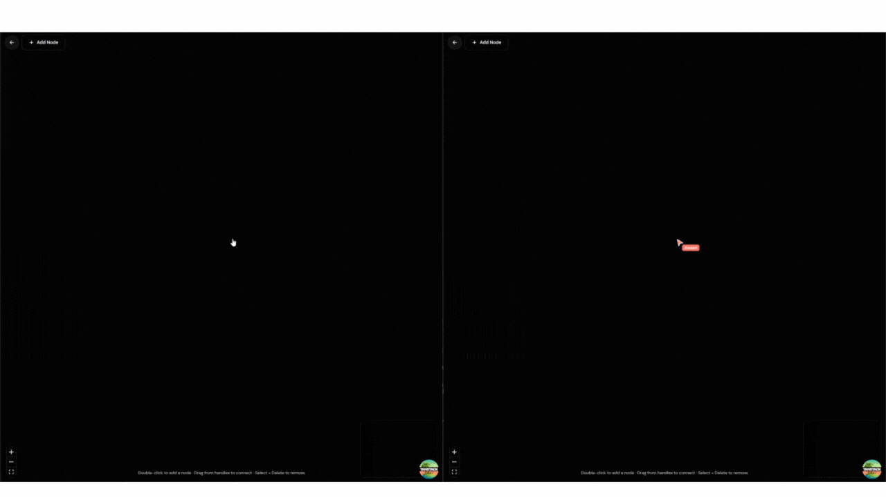
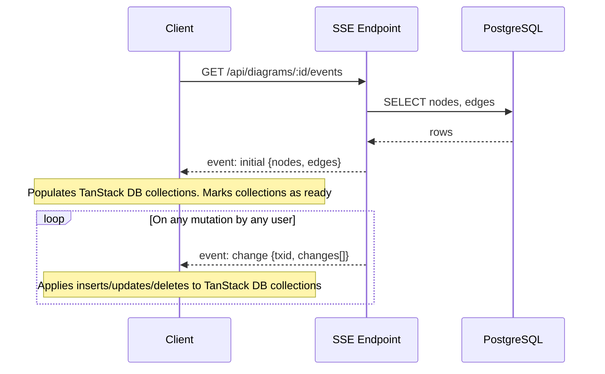
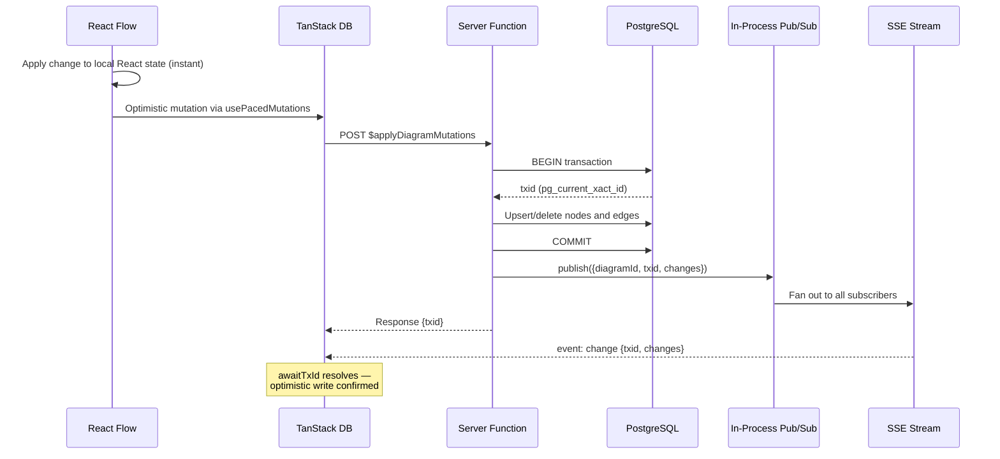
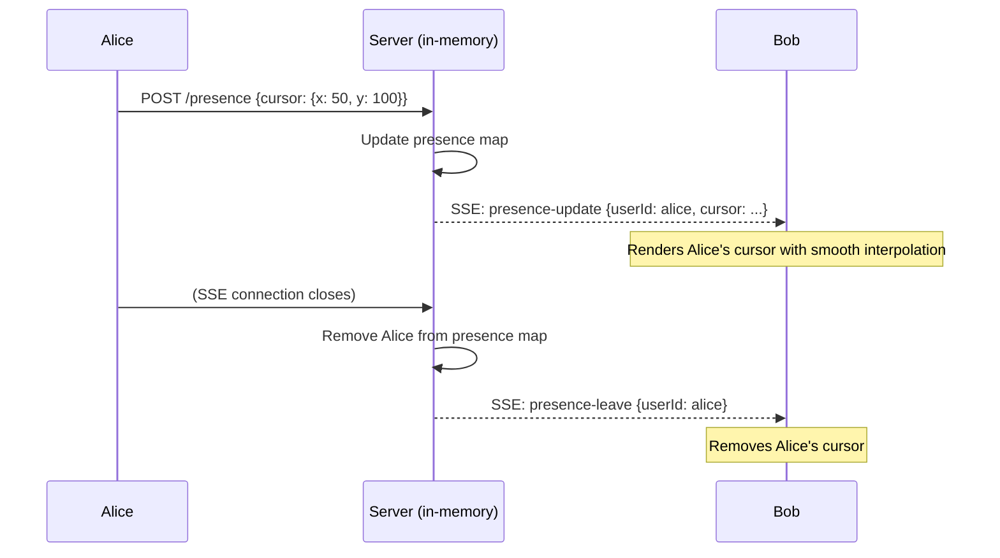

# Getting Started

To run this application:


```bash
cp .env.example .env
```

Fill in necessary env variables and then


```bash
pnpm install
pnpm dev
```

# Building For Production

To build this application for production:

```bash
pnpm build
```

## Testing

This project uses [Vitest](https://vitest.dev/) for testing. You can run the tests with:

```bash
pnpm test
```

# Syncing System

A real-time multiplayer diagram editor built on **TanStack DB**, **Server-Sent Events (SSE)**, and **PostgreSQL**. Multiple users can collaboratively edit the same diagram with optimistic local updates and server-authoritative conflict resolution.

## Demo



---

## Architecture Overview

The system has three layers that work together:


| Layer                 | Transport                           | What it carries                                   |
| --------------------- | ----------------------------------- | ------------------------------------------------- |
| **Initial Load**      | SSE `initial` event                 | Full snapshot of nodes and edges from Postgres    |
| **Diagram Mutations** | HTTP POST + SSE `change` events     | Node/edge creates, updates, deletes               |
| **Presence**          | HTTP POST + SSE `presence-`* events | Cursors, selections, drag state, connecting state |


```
┌──────────────────────────────────────────────────────────────────┐
│                        PostgreSQL                                │
│                     (source of truth)                             │
└──────────────┬───────────────────────────────┬───────────────────┘
               │                               │
               │  Drizzle ORM                  │  Drizzle ORM
               │                               │
        ┌──────▼──────┐                 ┌──────▼──────┐
        │   Server    │  in-process     │   Server    │
        │   Function  │◄── pub/sub ────►│   SSE       │
        │  (writes)   │                 │  (reads)    │
        └──────▲──────┘                 └──────┬──────┘
               │                               │
               │  HTTP POST                    │  EventSource
               │                               │
        ┌──────┴───────────────────────────────▼──────┐
        │              Browser Client                  │
        │  ┌─────────────┐    ┌───────────────────┐   │
        │  │  TanStack DB │◄──│  Sync Adapter     │   │
        │  │  Collections │    │  (EventSource)    │   │
        │  └──────┬──────┘    └───────────────────┘   │
        │         │                                    │
        │  ┌──────▼──────┐                             │
        │  │  React Flow  │                            │
        │  │  (Canvas UI) │                            │
        │  └─────────────┘                             │
        └─────────────────────────────────────────────┘
```

---

## Data Flow

### Subscribing (loading + live updates)

When a user opens a diagram, the client establishes a **single SSE connection** shared across both the nodes and edges collections. The server immediately sends the full state, then streams incremental changes.




### Writing (mutations)

Edits flow through an optimistic pipeline. The UI updates immediately, the mutation is sent to the server, and the client waits for its own change to echo back through the SSE stream before considering the write fully confirmed.




---

## Conflict Resolution

The system uses a **last-write-wins** strategy at the row level, enforced by PostgreSQL.

### How it works

- Every node and edge upsert uses `ON CONFLICT DO UPDATE` on the row's primary key.
- If two users edit the same node simultaneously, both writes succeed in sequence — the second transaction's values overwrite the first's.
- There is no field-level merge or CRDT. The entire row is replaced.

### Example: Two users move the same node

```
Timeline
────────────────────────────────────────────────────

  Alice drags Node-A           Bob drags Node-A
  to (100, 200)                to (300, 400)
       │                            │
       ▼                            ▼
  POST mutation               POST mutation
  (posX=100, posY=200)        (posX=300, posY=400)
       │                            │
       ▼                            ▼
  ┌─ PostgreSQL ──────────────────────────────┐
  │  tx-1: UPSERT Node-A (100, 200) ✓        │
  │  tx-2: UPSERT Node-A (300, 400) ✓        │
  │                                           │
  │  Final state: Node-A at (300, 400)        │
  └───────────────────────────────────────────┘
       │                            │
       ▼                            ▼
  SSE: change tx-1             SSE: change tx-1
  SSE: change tx-2             SSE: change tx-2
       │                            │
       ▼                            ▼
  Both clients converge        Both clients converge
  to (300, 400)                to (300, 400)
```

Both clients eventually see the same state because they both receive the same ordered sequence of SSE events. The last committed transaction wins.

---

## Transaction ID Acknowledgment (txid)

A key mechanism that ties optimistic local state to server-confirmed state.

```
Client writes mutation ──► Server returns {txid: "12345"}
                                    │
                                    ▼
                           Client calls awaitTxId("12345")
                           (blocks up to 5 seconds)
                                    │
                    ┌───────────────┼───────────────┐
                    ▼                               ▼
           SSE delivers              Timeout (5s) fires
           change with               awaitTxId rejects
           txid "12345"              with timeout error
                    │
                    ▼
           awaitTxId resolves ✓
           Mutation confirmed
```

This ensures the client knows its own write has been applied server-side and broadcast to all peers before the paced mutation transaction completes.

---

## Failure Scenarios

### SSE connection drops

The browser's built-in `EventSource` handles reconnection automatically. On reconnect, the server sends a fresh `initial` snapshot, bringing the client back to a consistent state.

```
Client ──── SSE connected ────── SSE drops ──── auto-reconnect
                                                      │
                                                      ▼
                                              Server sends full
                                              "initial" snapshot
                                                      │
                                                      ▼
                                              Client rebuilds
                                              TanStack DB state
```

### User navigates away or closes the diagram

When the SSE connection closes (either by navigation or tab close):

1. The server detects the `abort` signal on the request
2. Server unsubscribes from pub/sub and removes the user's presence
3. Client-side cleanup rejects all pending `awaitTxId` promises
4. The shared `EventSource` is released (ref-counted — only closed when no collections need it)

### Mutation fails (network error)

If the HTTP POST to `$applyDiagramMutations` fails:

1. The optimistic update remains in local React state temporarily
2. The `mutationFn` throws, and the paced mutation pipeline handles the error
3. Since no `txid` was returned, `awaitTxId` is never called
4. On the next SSE `change` event or reconnection, the authoritative server state overwrites the stale optimistic state

### awaitTxId times out

If the SSE stream doesn't deliver the expected `txid` within **5 seconds**:

1. `awaitTxId` rejects with a timeout error
2. The mutation is still committed in PostgreSQL (the write succeeded)
3. The SSE stream will eventually deliver the change, reconciling the state

---

## Presence (Ephemeral State)

Presence data (cursors, selections, drag indicators, connection previews) is **not persisted** — it lives in server memory and is broadcast over the same SSE connection.




### What presence tracks


| Field                                 | Purpose                                           |
| ------------------------------------- | ------------------------------------------------- |
| `cursor`                              | Mouse position on the canvas                      |
| `selectedNodeIds` / `selectedEdgeIds` | Which elements the user has selected              |
| `draggingNodeId` + `draggingPosition` | Live drag preview for other users                 |
| `connectingFrom`                      | Shows other users when someone is drawing an edge |


---

## Event Reference

All events flow over a single SSE connection per diagram.


| SSE Event          | Direction        | Payload                        | Purpose                        |
| ------------------ | ---------------- | ------------------------------ | ------------------------------ |
| `initial`          | Server -> Client | `{nodes[], edges[]}`           | Full state snapshot on connect |
| `change`           | Server -> Client | `{diagramId, txid, changes[]}` | Incremental mutation batch     |
| `presence-initial` | Server -> Client | `PresenceState[]`              | Current presence of all users  |
| `presence-update`  | Server -> Client | `{type: "update", state}`      | A user's presence changed      |
| `presence-leave`   | Server -> Client | `{type: "leave", userId}`      | A user disconnected            |


Each `change` event contains an array of change items:

```typescript
{
  type: "insert" | "update" | "delete",
  table: "nodes" | "edges",
  key: string,       // row ID
  value?: object     // full row data (omitted for deletes)
}
```

---

## Summary

```
┌─────────────────────────────────────────────────────┐
│                   Key Properties                     │
├─────────────────────────────────────────────────────┤
│  Source of truth       PostgreSQL                     │
│  Client state          TanStack DB collections        │
│  Transport             SSE (EventSource)              │
│  Writes                HTTP POST (server functions)   │
│  Fan-out               In-process pub/sub             │
│  Conflict resolution   Last-write-wins (row-level)    │
│  Optimistic updates    Yes (usePacedMutations)        │
│  Write confirmation    txid echo via SSE (5s timeout) │
│  Presence              Ephemeral, in-memory           │
│  Offline support       Not implemented                │
└─────────────────────────────────────────────────────┘
```
